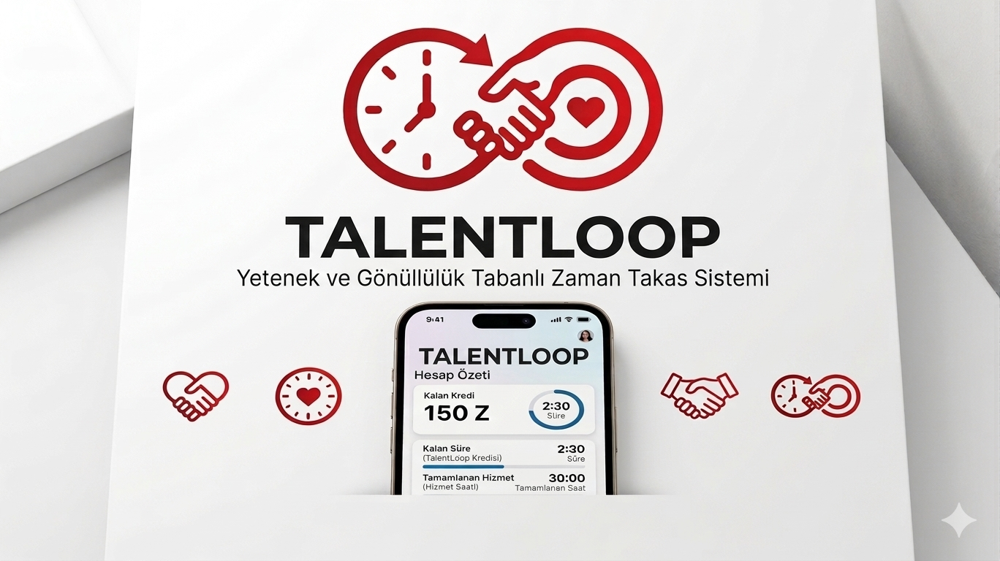

# MissX-KhadijaAbbasova

TalantLoop - İnteraktif bir yetenek takas arayüzü

---

## Proje Tanımı:

TalantLoop, insanların sahip oldukları yetenekleri birbirleriyle takas edebildiği bir zaman kredisi platformudur. Kullanıcılar sisteme kayıt olarak "1 saat Python dersi verebilirim" gibi ilanlar açabilir, başkalarının ilanlarından yararlanabilir ve her tamamlanan hizmet karşılığında zaman kredisi kazanabilirler. Platform sayesinde para kullanmadan, yalnızca zaman ve bilgi paylaşımıyla topluluk içinde değer alışverişi yapılabilmektedir.

**Proje Kategorisi:** Sosyal Platform / Zaman Bankası

**Referans Uygulama:** [hOurworld - Time Banking](https://hourworld.org)

---

## Proje Ekibi

**Grup Adı:** MissX

**Ekip Üyeleri:**

- Khadija Abbasova

---

## Dokümantasyon

Proje dokümantasyonuna aşağıdaki linklerden erişebilirsiniz:

1. [Gereksinim Analizi](Gereksinim-Analizi.md)
2. [REST API Tasarımı](API-Tasarimi.md)
3. [REST API](REST-API.md)
4. [Web Front-End](WebFrontEnd.md)
5. [Mobil Front-End](MobilFrontEnd.md)
6. [Mobil Backend](MobilBackEnd.md)
7. [Video Sunum](Sunum.md)

---

## Proje Linkleri

- **REST API Adresi:** [api.talantloop.com](https://api.talantloop.com)
- **Web Frontend Adresi:** [frontend.talantloop.com](https://frontend.talantloop.com)
